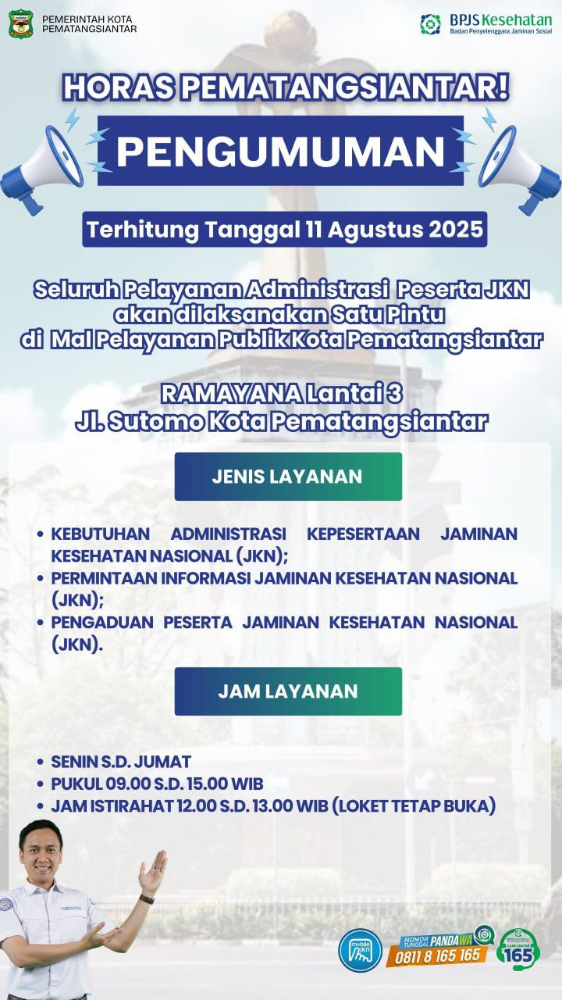

# 🏥 Pusat Informasi Badan Usaha
### BPJS Kesehatan KC Pematangsiantar

<div align="center">


**Website informasi layanan administrasi Badan Usaha BPJS Kesehatan KC Pematangsiantar.**  
Dibangun murni dengan HTML5, CSS3, dan Vanilla JavaScript — siap deploy ke GitHub Pages tanpa framework tambahan.

</div>

---

## 📌 Daftar Isi

- [Fitur](#-fitur)
- [Struktur File](#-struktur-file)
- [Konfigurasi](#-konfigurasi)
  - [Logo BPJS](#1-logo-bpjs-kesehatan)
  - [WhatsApp Contact](#2-nomor-whatsapp-contact-person)
  - [Foto Contact Person](#3-foto-contact-person)
  - [Foto Galeri](#4-foto-galeri-7-foto)
  - [Foto Berita](#5-foto-berita-whats-new)
  - [File Panduan eDabu](#6-file-panduan-edabu-11-file)
  - [Isi Berita](#7-memperbarui-isi-berita-whats-new)
  - [News Ticker](#8-news-ticker)
  - [Google Maps](#9-google-maps-embed)
- [Deploy GitHub Pages](#-deploy-ke-github-pages)
- [Menjalankan Lokal](#-menjalankan-secara-lokal)
- [Kustomisasi Tampilan](#-kustomisasi-tampilan)
- [Teknologi](#-teknologi)
- [Info Kantor](#-informasi-kantor)

---

## ✨ Fitur

| Fitur | Keterangan |
|---|---|
| 🌙 **Dark / Light Mode** | Toggle tema gelap/terang, tersimpan di browser, sinkron dengan setelan OS |
| 🌐 **Bilingual (ID / EN)** | Seluruh teks tersedia dalam Bahasa Indonesia dan English, toggle di navbar |
| 📱 **Fully Responsive** | Tampilan optimal di semua ukuran layar — mobile, tablet, laptop, desktop |
| 🏷️ **Logo BPJS** | Logo resmi tampil di navbar, hero, dan footer; dengan fallback otomatis |
| 📄 **Informasi Layanan** | 5 kartu dokumen utama (PDF, JPG, DOCX) |
| 📚 **Panduan eDabu (11 panduan)** | Panduan lengkap administrasi kepesertaan dengan filter tab kategori |
| 📰 **What's New** | 3 kartu berita terkini dengan foto, tanggal, kategori, dan badge |
| 🖼️ **Galeri + Lightbox** | 7 foto kegiatan dengan viewer fullscreen dan navigasi ← → |
| 📢 **News Ticker** | Scrolling bar pengumuman otomatis di bawah hero |
| ✨ **Hero Particles** | Animasi partikel mengambang di section hero |
| 👥 **Contact Person** | 4 kartu petugas dengan foto dan tombol langsung ke WhatsApp |
| 📍 **Lokasi + Maps** | Embed Google Maps, jam operasional, tombol petunjuk arah |
| ⬆️ **Back to Top** | Tombol kembali ke atas, muncul setelah scroll 400px |
| 🔄 **Scroll Reveal** | Animasi kartu saat pertama kali masuk ke viewport |

---

## 📁 Struktur File

```
/
├── index.html                                         ← Halaman utama
├── style.css                                          ← Styling lengkap (dark/light, responsive)
├── script.js                                          ← Interaktivitas (i18n, tema, galeri, dll)
├── README.md                                          ← Dokumentasi ini
│
└── files/
    │
    ├── photos/
    │   ├── logo-bpjs.png                              ← Logo BPJS Kesehatan (navbar, hero, footer)
    │   ├── siantar.png                                ← Favicon tab browser
    │   │
    │   ├── evalyn.jpg                                 ← Foto Contact: Evalyn Lumban Raja
    │   ├── dzaky.jpg                                  ← Foto Contact: Muhammad Dzaky
    │   ├── andri.jpg                                  ← Foto Contact: Andri Dwi Surya
    │   ├── junaina.jpg                                ← Foto Contact: Junaina Sahputri Sagala
    │   │
    │   ├── news1.jpg                                  ← Foto berita: Jenis Pelayanan & Jam Layanan
    │   ├── news2.jpg                                  ← Foto berita: BPJS Siap Membantu
    │   ├── news3.jpg                                  ← Foto berita: Ayo Kita Semua Wajib Skrining
    │   │
    │   ├── galeri1.jpg                                ← Galeri: Gathering Badan Usaha
    │   ├── galeri2.jpg                                ← Galeri: Gathering Badan Usaha
    │   ├── galeri3.jpg                                ← Galeri: Gathering Badan Usaha
    │   ├── galeri4.jpg                                ← Galeri: Pemberian Penghargaan PBPU Kolektif
    │   ├── galeri5.jpg                                ← Galeri: Sosialisasi Terhadap Badan Usaha
    │   ├── galeri6.jpg                                ← Galeri: Awarding Satya JKN (foto 1)
    │   └── galeri7.jpg                                ← Galeri: Awarding Satya JKN (foto 2)
    │
    ├── TATA CARA PENONAKTIFAN PEKERJA DARI EDABU NEW.pdf
    ├── REHAB.jpg
    ├── TATA CARA UBAH GAJI EDABU BADAN USAHA.pdf
    ├── Format Penonaktifan Pekerja.docx
    ├── Usman Edabu BU v 7.14.0.pdf
    │
    └── panduan/
        ├── pendaftaran-karyawan-baru.pdf              ← Pendaftaran Karyawan Baru Belum Terdaftar JKN
        ├── pendaftaran-isat.pdf                       ← Pendaftaran Pekerja dari ISAT di BU yang Sama
        ├── mutasi-keluarga.pdf                        ← Mutasi Anggota Keluarga Tambahan
        ├── reaktivasi-anak.pdf                        ← Re-aktivasi Anak Usia di atas 21 Tahun
        ├── penonaktifan-keluarga.pdf                  ← Penonaktifan Anggota Keluarga
        ├── pendaftaran-isa-wna.pdf                    ← Pendaftaran ISA WNA Belum Terdaftar JKN
        ├── tambah-keluarga-segmen.pdf                 ← Tambah Keluarga dari Segmen Lain
        ├── tambah-keluarga-baru.pdf                   ← Tambah Keluarga Baru
        ├── pendaftaran-wna.pdf                        ← Pendaftaran Pekerja WNA Belum Terdaftar JKN
        ├── mutasi-pbpu-ppu.pdf                        ← Pendaftaran Karyawan Mutasi PBPU ke PPU
        └── selaras.pdf                                ← Sentra Layanan Administrasi (Selaras)
```

---

## ⚙️ Konfigurasi

### 1. Logo BPJS Kesehatan

Letakkan file logo resmi BPJS Kesehatan di:

```
files/photos/logo-bpjs.png
```

Logo ditampilkan di tiga tempat: **navbar** (kiri atas), **section hero** (tengah, besar), dan **footer**.

> **Tips:** Gunakan format PNG dengan latar transparan agar logo terlihat baik di tema terang maupun gelap.  
> Jika file tidak ditemukan, ikon `🛡️` (Font Awesome `fa-shield-heart`) akan tampil otomatis sebagai pengganti.

---

### 2. Nomor WhatsApp Contact Person

Buka `index.html`, cari komentar `CONTACT PERSON`, lalu ubah nomor pada atribut `href` masing-masing kartu.  
Format: tanpa tanda `+`, awali dengan `62` (kode negara Indonesia).

| Nama Petugas | Nomor Saat Ini | Atribut di HTML |
|---|---|---|
| Evalyn Lumban Raja | `628116200840` | `href="https://wa.me/628116200840"` |
| Muhammad Dzaky | `6285275353860` | `href="https://wa.me/6285275353860"` |
| Andri Dwi Surya | `6285762338553` | `href="https://wa.me/6285762338553"` |
| Junaina Sahputri Sagala | `6287751077004` | `href="https://wa.me/6287751077004"` |

**Cara konversi nomor:**
```
0812-3456-7890  →  6281234567890
```

---

### 3. Foto Contact Person

Upload foto ke folder `files/photos/` dengan nama file yang **persis** sama:

| Nama File | Petugas | Spesifikasi |
|---|---|---|
| `evalyn.jpg` | Evalyn Lumban Raja | Foto formal, min 300×300px, maks 200KB |
| `dzaky.jpg` | Muhammad Dzaky | Foto formal, min 300×300px, maks 200KB |
| `andri.jpg` | Andri Dwi Surya | Foto formal, min 300×300px, maks 200KB |
| `junaina.jpg` | Junaina Sahputri Sagala | Foto formal, min 300×300px, maks 200KB |

> Jika foto belum tersedia, avatar warna dengan ikon akan tampil otomatis.

---

### 4. Foto Galeri (7 Foto)

Upload 7 foto ke `files/photos/` dengan nama sesuai. Keterangan saat ini:

| Nama File | Keterangan di Website |
|---|---|
| `galeri1.jpg` | Gathering Badan Usaha |
| `galeri2.jpg` | Gathering Badan Usaha |
| `galeri3.jpg` | Gathering Badan Usaha |
| `galeri4.jpg` | Pemberian Penghargaan PBPU Kolektif Kepada Badan Usaha Berkontribusi |
| `galeri5.jpg` | Sosialisasi Terhadap Badan Usaha |
| `galeri6.jpg` | Awarding Satya JKN Badan Usaha Terbaik Nasional |
| `galeri7.jpg` | Awarding Satya JKN Badan Usaha Terbaik Nasional |

**Ukuran ideal:** Landscape, minimal 800×600px, maks 500KB per file.

**Mengubah keterangan foto:** Buka `index.html`, cari teks keterangan di dalam tag:
```html
<span data-i18n="gal1_cap">Gathering Badan Usaha</span>
```
Ubah teksnya, lalu perbarui juga terjemahan Inggrisnya di `script.js`:
```js
// objek en: { ... }
gal1_cap: "Business Entity Gathering",
```

**Menambah foto galeri baru:** Salin blok `<div class="gal-item">` yang sudah ada,
ubah nama file gambar dan keterangan, lalu simpan.

---

### 5. Foto Berita (What's New)

Upload 3 foto ke `files/photos/`. Berita yang tampil saat ini:

| File | Judul Berita | Tanggal | Kategori |
|---|---|---|---|
| `news1.jpg` | Jenis Pelayanan dan Jam Layanan | Maret 2025 | Update |
| `news2.jpg` | BPJS Siap Membantu | September 2025 | Layanan |
| `news3.jpg` | Ayo Kita Semua Wajib Skrining | Agustus 2025 | Skrining Kesehatan |

**Ukuran ideal:** Landscape, minimal 800×500px, maks 400KB.

> Jika foto tidak ditemukan, background gradasi biru tampil otomatis.

---

### 6. File Panduan eDabu (11 File)

Upload semua file PDF ke folder `files/panduan/`. Nama file harus **persis** sama:

**Kategori: Pendaftaran** *(filter tab "Pendaftaran")*

| Nama File | Panduan |
|---|---|
| `pendaftaran-karyawan-baru.pdf` | Pendaftaran Karyawan Baru Belum Terdaftar JKN |
| `pendaftaran-isat.pdf` | Pendaftaran Pekerja dari ISAT di BU yang Sama |
| `pendaftaran-isa-wna.pdf` | Pendaftaran ISA WNA Belum Terdaftar JKN |
| `pendaftaran-wna.pdf` | Pendaftaran Pekerja WNA Belum Terdaftar JKN |
| `mutasi-pbpu-ppu.pdf` | Pendaftaran Karyawan Mutasi PBPU ke PPU |

**Kategori: Keluarga** *(filter tab "Keluarga")*

| Nama File | Panduan |
|---|---|
| `mutasi-keluarga.pdf` | Mutasi Anggota Keluarga Tambahan |
| `reaktivasi-anak.pdf` | Re-aktivasi Anak Usia di atas 21 Tahun |
| `penonaktifan-keluarga.pdf` | Penonaktifan Anggota Keluarga Tidak Ditanggung/Meninggal |
| `tambah-keluarga-segmen.pdf` | Tambah Keluarga dari Segmen Lain |
| `tambah-keluarga-baru.pdf` | Tambah Keluarga Baru |

**Kategori: Lainnya** *(filter tab "Lainnya")*

| Nama File | Panduan |
|---|---|
| `selaras.pdf` | Sentra Layanan Administrasi Kepesertaan (Selaras) |

---

### 7. Memperbarui Isi Berita (What's New)

Buka `index.html`, cari komentar `WHAT'S NEW / BERITA`. Setiap kartu berita memiliki struktur:

```html
<div class="news-card">
  <div class="news-img-wrap">
           ← ganti nama file foto
    <span class="news-badge">Baru</span>           ← ganti teks badge: Baru / Info / Pengumuman
  </div>
  <div class="news-body">
    <span class="news-cat">Update</span>            ← ganti kategori
    <span class="news-date">Maret 2025</span>       ← ganti tanggal
    <h3 class="news-title">Judul Berita</h3>        ← ganti judul
    <p  class="news-excerpt">Deskripsi...</p>       ← ganti deskripsi
    <a  href="files/photos/news1.jpg">...</a>       ← ganti link tujuan
  </div>
</div>
```

Perbarui juga terjemahan Inggris di `script.js` untuk key:
`news1_title`, `news1_desc`, `news2_title`, `news2_desc`, `news3_title`, `news3_desc`

---

### 8. News Ticker

Teks berjalan yang tampil saat ini di bagian `<div id="tickerItems">`:

```
📢 User Manual eDabu versi 7.14.0 telah dirilis
📋 Format baru Penonaktifan Pekerja sudah tersedia
🏥 Jam pelayanan: Senin–Jumat 09.00–15.00 WIB
📞 Hotline BPJS Kesehatan: 165
```

Untuk mengubah, buka `index.html` dan edit isi masing-masing `<span>`:

```html
<div class="ticker-items" id="tickerItems">
  <span data-i18n="tick1">📢 Teks pesan pertama Anda</span>
  <span data-i18n="tick2">📋 Teks pesan kedua Anda</span>
  <span data-i18n="tick3">🏥 Teks pesan ketiga Anda</span>
  <span data-i18n="tick4">📞 Teks pesan keempat Anda</span>
</div>
```

Perbarui juga terjemahan di `script.js`:
```js
// Objek id: { ... }
tick1: "📢 Pesan dalam Bahasa Indonesia",
// Objek en: { ... }
tick1: "📢 Message in English",
```

---

### 9. Google Maps Embed

Peta saat ini menggunakan koordinat placeholder. Untuk mengganti dengan lokasi kantor yang akurat:

1. Buka [Google Maps](https://maps.google.com)
2. Cari: **BPJS Kesehatan Cabang Pematangsiantar**
3. Klik **Share** → **Embed a map** → **Copy HTML**
4. Ambil nilai `src="..."` dari kode iframe yang disalin
5. Buka `index.html`, cari bagian `<div class="map-wrapper">`, ganti nilai `src` pada `<iframe>`

---

## 🚀 Deploy ke GitHub Pages

### Cara 1 — Via Browser (Tanpa Git)

1. Login ke [github.com](https://github.com) → klik **New repository**
2. Isi nama repo (contoh: `bpjs-bu-siantar`), pilih **Public** → **Create repository**
3. Klik **uploading an existing file**
4. Upload semua file dan folder:
   - `index.html`, `style.css`, `script.js`, `README.md`
   - Folder `files/` beserta seluruh isinya
5. Klik **Commit changes**
6. Masuk ke **Settings → Pages**
7. Di bagian **Source**, pilih: **Deploy from a branch** → Branch: **main** → Folder: **/ (root)** → **Save**
8. Tunggu 1–3 menit. Website aktif di:

```
https://<username>.github.io/<nama-repo>/
```

---

### Cara 2 — Via Terminal (Git CLI)

```bash
# Masuk ke folder proyek
cd /path/ke/folder-proyek

# Inisialisasi Git
git init
git remote add origin https://github.com/<username>/<nama-repo>.git

# Tambah & commit semua file
git add .
git commit -m "🏥 Initial release – BPJS Kesehatan KC Pematangsiantar"

# Push ke GitHub
git branch -M main
git push -u origin main
```

Setelah push, aktifkan GitHub Pages:
**Settings → Pages → Source: Deploy from branch → main → / (root) → Save**

---

### Cara 3 — Custom Domain (Opsional)

Untuk menggunakan domain sendiri (misal `bu.bpjssiantar.id`):

1. Buat file `CNAME` di root folder, isi dengan nama domain:
   ```
   bu.bpjssiantar.id
   ```
2. Di panel DNS domain, buat CNAME record:
   - **Host:** `bu`
   - **Points to:** `<username>.github.io`
3. Di **Settings → Pages → Custom domain**, masukkan nama domain → Save
4. Centang **Enforce HTTPS** setelah sertifikat aktif (±24 jam)

---

## 🛠️ Menjalankan Secara Lokal

Tidak perlu Node.js atau build tool. Tiga opsi tersedia:

```bash
# Opsi 1: VS Code Live Server (DISARANKAN)
# Install extension "Live Server" di VS Code
# Klik kanan pada index.html → "Open with Live Server"
# Buka: http://127.0.0.1:5500

# Opsi 2: Python (sudah terinstall di macOS/Linux)
cd /path/ke/folder-proyek
python3 -m http.server 8000
# Buka: http://localhost:8000

# Opsi 3: Node.js
npx http-server .
# Buka: http://localhost:8080
```

> **Catatan:** Membuka `index.html` langsung (double-click) menyebabkan foto dan PDF tidak tampil karena browser memblokir akses file lokal. Gunakan salah satu server di atas.

---

## 🎨 Kustomisasi Tampilan

### Warna Utama

Buka `style.css`, temukan blok `:root, [data-theme="light"]`:

```css
:root, [data-theme="light"] {
  --c-primary:   #006db3;   /* Biru utama BPJS */
  --c-accent:    #009FE3;   /* Biru aksen */
  --c-accent-l:  #7dd0f0;   /* Biru terang (highlight hero) */
}
```

Untuk dark mode, ubah juga di blok `[data-theme="dark"]`.

### Font

Ganti URL Google Fonts di `index.html` bagian `<head>`, lalu sesuaikan di `style.css`:

```css
body {
  font-family: 'Plus Jakarta Sans', 'Poppins', sans-serif;
}
.section-title, .hero-title, .hstat-n {
  font-family: 'Poppins', sans-serif;
}
```

### Menambah Kartu Panduan eDabu Baru

Salin template ini ke dalam `<div id="panduanGrid">` di `index.html`:

```html
<div class="info-card" data-delay="0" data-cat="daftar">
  <!-- data-cat: "daftar" | "keluarga" | "lainnya" -->
  <div class="card-glow"></div>
  <div class="card-icon-wrap" style="--cc:#0077cc">
    <i class="fa-solid fa-user-plus"></i>
  </div>
  <div class="card-body">
    <span class="card-tag">Panduan</span>
    <h3 class="card-title">Judul Panduan Baru</h3>
    <p  class="card-desc">Deskripsi singkat panduan ini.</p>
  </div>
  <div class="card-footer">
    <a href="files/panduan/nama-file-baru.pdf" target="_blank" class="btn-card">
      <i class="fa-solid fa-eye"></i> Lihat / Unduh
    </a>
    <span class="card-type"><i class="fa-solid fa-file-pdf"></i> PDF</span>
  </div>
</div>
```

### Menambah Foto Galeri Baru

Untuk menambah lebih dari 7 foto galeri, salin blok ini ke dalam `<div id="galleryGrid">`:

```html
<div class="gal-item" data-delay="0">
  
  <div class="gal-overlay">
    <i class="fa-solid fa-magnifying-glass-plus"></i>
    <span>Keterangan Foto Baru</span>
  </div>
</div>
```

---

## 🖼️ Spesifikasi Foto

| Jenis | Format | Ukuran Min | Rasio | Maks File |
|---|---|---|---|---|
| Logo BPJS | PNG (transparan) | 200×80px | Bebas | 50KB |
| Contact Person | JPG / PNG | 300×300px | 1:1 | 200KB |
| Galeri | JPG | 800×600px | 4:3 | 500KB |
| Berita (News) | JPG | 800×500px | 16:10 | 400KB |
| Favicon | PNG | 32×32px | 1:1 | 10KB |

**Tools kompresi foto gratis:**
- [Squoosh](https://squoosh.app) — kompresi & konversi format, berbasis browser
- [TinyPNG](https://tinypng.com) — kompresi PNG/JPG otomatis
- [iLoveIMG](https://www.iloveimg.com/compress-image) — kompresi batch

---

## 🧰 Teknologi

| Teknologi | Versi | Kegunaan |
|---|---|---|
| HTML5 | — | Struktur halaman, semantik, aksesibilitas |
| CSS3 | — | Styling, animasi, custom properties, responsive grid |
| JavaScript (Vanilla) | ES6+ | i18n bilingual, dark/light mode, galeri lightbox, filter tab, scroll reveal, particles |
| [Font Awesome](https://fontawesome.com) | 6.5.0 | Ikon seluruh halaman |
| [Plus Jakarta Sans](https://fonts.google.com/specimen/Plus+Jakarta+Sans) | — | Font body utama |
| [Poppins](https://fonts.google.com/specimen/Poppins) | — | Font heading & statistik hero |
| [GitHub Pages](https://pages.github.com) | — | Hosting gratis, zero-config |

---

## 📞 Informasi Kantor

| | |
|---|---|
| **Nama** | BPJS Kesehatan Kantor Cabang Pematangsiantar |
| **Alamat** | Jl. Perintis Kemerdekaan No. 7, Pematangsiantar, Sumatera Utara |
| **Hotline** | **165** (Gratis) |
| **Website Resmi** | [www.bpjs-kesehatan.go.id](https://www.bpjs-kesehatan.go.id) |
| **Jam Operasional** | Senin – Jumat, **09.00 – 15.00 WIB** |

---

## 📝 Riwayat Perubahan

| Versi | Keterangan |
|---|---|
| **2.0.0** | Bilingual ID/EN · 7 foto galeri + lightbox · 11 panduan eDabu + filter tab · 3 berita What's New · News ticker · Hero particles · Back-to-top · Logo BPJS · Footer 3 kolom · Social media |
| **1.1.0** | Dark/Light mode · Toggle tema |
| **1.0.0** | Initial release: 5 layanan, 4 contact person, lokasi |

---

<div align="center">

**© 2025 BPJS Kesehatan KC Pematangsiantar**  
*Melayani dengan sepenuh hati untuk Indonesia yang lebih sehat.*

</div>
